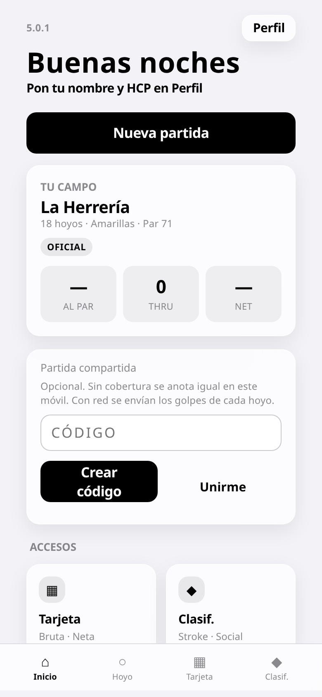

# Fairway

Fairway es el marcador de golf personal para el iPhone. Funciona en Safari y en la pantalla de inicio, sin cuenta y sin cobertura: golpes, putts, bruto, neto y Stableford, con varios jugadores en el mismo teléfono. El hándicap de campo sigue el WHS. La partida se queda en el aparato.

La app publicada está en https://ardu01.github.io/app-golf/.

La versión actual del código es **5.1.4**. En el código, `APP_VERSION`, la cabecera de Inicio, el perfil («Fairway 5.1.4»), el manifiesto («Marcador de golf personal · 5.1.4») y `appVersion` del JSON de copia dicen 5.1.4. El shell es `fairway-v5-514`. El esquema de la copia sigue en **3**: las copias de la 4.0.11 a la 5.1.3 siguen entrando. La release publicada es [v5.1.3](https://github.com/ardu01/app-golf/releases/tag/v5.1.3), «Fairway 5.1.3», el 2026-10-04T18:05:55Z, sobre `b3a05419ea7220ca7f5efafaf1a6d1adc1fb1fbd`. El detalle de cada versión está en [`CHANGELOG.md`](CHANGELOG.md) y en las [releases](https://github.com/ardu01/app-golf/releases).

En la 5.1.4, en Tarjeta y en Bruta, el recuadro rojo de bogey+ se ciñe al número, del mismo tamaño que el cuadrado de bogey en Neta. Los puntos quedan fuera. Eagle, birdie, el modo Stableford y el aire de 12px no cambian. En la 5.1.3 la tarjeta tiene Stableford junto a Bruta y Neta. Los puntos son los de `stablefordHole`. En la 5.1.2 la tarjeta deja aire entre el recuadro y los botones de F9 · Ida / B9 · Vuelta, y entre el recuadro y Out, In y Al par. Al instalar, el service worker no hace `skipWaiting` y no recarga si hay una ronda abierta. En el repositorio no hay una captura de la 5.1.4. La de Inicio más reciente es la de la 5.0.1, más abajo.

## Qué se hace en una partida

Se elige campo, tee y jugadores, se anota hoyo a hoyo y se cierra la vuelta. La tarjeta enseña el bruto, el neto y el Stableford, y la clasificación ordena la partida. Esas pantallas son la base de la línea 3. No son capturas de la 5.1.0.

Lista de campos para empezar la vuelta.


Tees del campo elegido, con course rating y slope.


Jugadores de la partida en el mismo teléfono.


Marcador del hoyo: golpes y putts del jugador que está en la ficha.


Tarjeta bruta de la vuelta.


La misma tarjeta en neto.


Clasificación de la partida.


Perfil del jugador en el teléfono.


Historial de vueltas, para reabrir una tarjeta.


Estadísticas con vueltas ya jugadas.


[Elegir campo](docs/recorrido/videos/elegir-campo.mp4). El paseo por la lista de campos hasta dejar uno elegido.

[Ajustes, tarjeta y continuar](docs/recorrido/videos/ajustes-tarjeta-continuar.mp4). De los ajustes de la ronda a la tarjeta, y de ahí a seguir la vuelta.

[Paseo por la interfaz](docs/recorrido/videos/recorrido-interfaz.mp4). Recorrido por las pantallas de la partida.

[Stats y perfil](docs/recorrido/videos/stats-perfil.mp4). Estadísticas y la ficha del perfil.

Ajustes de la ronda abierta: campo, tee, hoyos y la bola de cada jugador. Abajo, cerrar la ronda.


La hoja de la bola, encima del marcador: se elige la bola del jugador que está en la ficha.


Al volver a Inicio con la ronda todavía abierta, la pastilla ofrece seguir o cerrar.


Reabrir una vuelta del historial: la hoja pide confirmar antes de cargar esa tarjeta.


Los tres iconos del perfil, de cerca: exportar, importar y borrar la copia.


Estadísticas con el filtro de temporada: este año, el anterior o todas.


## Hándicap

El course handicap sale del hándicap de juego, el CR y el slope del tee. En 18 hoyos el golpe va al índice de dificultad del hoyo. En 9, al índice relativo de esos nueve, no a «los hoyos 1 a 9». Estas capturas explican ese reparto. No son de la 5.1.0.

Tee con CR y slope, la base del hándicap de campo.


Hoyo que recibe golpe: el punto marca el stroke.


Hoyo 2 de una vuelta de 18 con course handicap 10, sin punto: ahí no toca golpe.


La misma salida recortada a 9 hoyos. En la captura el hándicap de campo baja de 10 a 5, y el hoyo 1 sigue llevando golpe.


En 9 hoyos, un hoyo que en 18 recibía golpe puede quedarse sin él. Aquí el hoyo 2, par 4, sin punto.


El golpe de 9 va al índice relativo de ese tramo. El hoyo 6, el más fácil de esos nueve, lleva el punto.


Vuelta de 18 con course handicap 10 en el marcador: diez hoyos con punto y el resto sin él.


[Hándicap en nueve hoyos](docs/recorrido/videos/handicap-9-hoyos.mp4). Cómo baja el hándicap de campo al pasar de 18 a 9 y dónde cae el golpe.

## Árbitro y modalidades

El árbitro es local: textos de las Reglas de Golf para la situación del hoyo. Stableford y Stroke Play van como modalidades oficiales; el resto, como juegos de la partida.

Árbitro en un área de penalización.


La ficha Árbitro en el marcador del hoyo, junto a Hoyos y Mapa.


El mismo acceso desde la clasificación: el botón Árbitro en la barra de arriba.


Lista de modalidades. Stableford y Stroke Play como oficiales; el resto, juegos de la partida.


[Reglas](docs/recorrido/videos/reglas.mp4). Las modalidades y los textos de reglas.

[Árbitro](docs/recorrido/videos/arbitro.mp4). Abrir el árbitro desde la partida.

## Planos del hoyo

La ficha Mapa sigue en la app. Al empezar una ronda se piden los planos de ese campo, no los de todos. Los archivos viven en `holes/`. Las fotos de esta sección están en `docs/recorrido/mapas/`: unas son la ficha dentro de la app, otras el plano o la foto del hoyo. No son capturas de la 5.1.0. Donde la cabecera se lee, se dice cuál es.

La Herrería, hoyo 1, dentro de la ficha Mapa: el plano a pantalla, con Marcador para volver.


Las Rozas, hoyo 1, la misma ficha.


[Mapas de Las Rozas](docs/recorrido/videos/mapas-las-rozas.mp4). La ficha Mapa del hoyo 1 (La Encina) y, en otro tramo, la tarjeta de esa vuelta.

El Robledal, hoyo 1, ficha Mapa en la app. La cabecera de esta captura es 4.0.11.


Foto del mismo hoyo 1, calle y green, aparte del plano.


Plano de trazo del Robledal, hoyo 1: salida, calle, green y la distancia de la barra de arriba.


Golf Santander, ficha Mapa del hoyo 1 en la app.


La foto de satélite de ese hoyo 1, la que enseña la ficha.


Torrejón, hoyo 1, ficha Mapa en la app.


Vista del hoyo 1 de Torrejón, green y bandera.


RSHECC Norte, hoyo 1, ficha Mapa en la app.


Foto aérea del hoyo 1 Norte.


Plano del hoyo 1 Norte, con la distancia en el margen.


RSHECC Sur, foto del hoyo 1.


Otra vista del Sur, calle hacia el green.


Aranjuez, hoyo 1: la foto de la calle.


El plano de trazo de ese hoyo: salida, calle y green.


La Finca, hoyo 1, foto de la calle.


Plano del mismo hoyo de La Finca.


El Encín, hoyo 1, foto aérea de la calle.


Hoja de referencia del hoyo 1 de La Dehesa del Escorial: par, hándicap y metros por tee. No es la ficha Mapa.


Tres campos en una hoja: La Moraleja, Olivar de la Hinojosa y Torrejón. Tampoco es la ficha de la app.


## Inicio en las versiones que tienen foto

Inicio con una ronda a medias en La Herrería (3/18) y el botón de continuar. La cabecera de esta captura marca 4.0.11.


La 4.1 deja Inicio, Perfil y el historial en el teléfono, con Drive opcional. Estas tres capturas y el vídeo son de esa línea.

Inicio de la 4.1: la versión en la cabecera, el botón de partida y la barra de abajo.


Perfil con la copia JSON, esquema 3, y Google Drive. El archivo es `Fairway/fairway-data.json`; el token se queda en memoria.


Historial leído en el dispositivo.


[De Inicio a Perfil y Drive](docs/recorrido/4.1/tour-4.1.mp4). El paseo Inicio, Perfil y la conexión de Drive en la 4.1.

La 4.2.6 es la última de la línea 4. Las fotos y los vídeos de `docs/recorrido/cursor/` que siguen se tomaron cuando la cabecera decía 4.2.6.

Inicio. La cabecera dice 4.2.6. «Buenas noches, Ana», ronda en curso en La Herrería (hoyo 18), Continuar, Ajustes, Cerrar ronda, y el campo del código de la partida compartida.


Paso Campo. La Herrería está seleccionada, Centro Nacional de Golf queda encima, y Siguiente está abajo.


Tarjeta bruta de La Herrería, 18 hoyos, tee Amarillas. La ida va al par: OUT 35, TOT 71, course handicap 13.


[De la lista de campos a la tarjeta](docs/recorrido/cursor/course_list_and_scorecard.mp4). Del paso Campo, con La Herrería elegida, a la tarjeta bruta. En los tramos que se ven, la lista y luego la tarjeta con OUT 35 y TOT 71. La cabecera de esa sesión decía 4.2.6.

Inicio en Chrome de escritorio, en `127.0.0.1`. La cabecera dice 4.2.6. La Herrería figura como campo, y la partida compartida ofrece Crear código y Unirme.


El mismo escritorio, paso Campo, con Centro Nacional de Golf seleccionado.


Hoyo 1 de Centro Nacional dentro de la app: par 5, 476 m, y las yardas escritas en el plano.


[Empezar la ronda y abrir el plano](docs/recorrido/cursor/start_round_centro_nacional_map.mp4). Arranca en el paso Campo con Centro Nacional seleccionado y llega al plano del hoyo 1 (par 5, 476 m). La cabecera de esa sesión decía 4.2.6.

Inicio de la 5.0.1, columna centrada. La cabecera dice 5.0.1. A la derecha, Perfil; el saludo; Nueva partida; la ficha de La Herrería; la partida compartida; y la barra de abajo. El mismo margen a los dos lados. La 5.1.0 no tiene captura propia: las pantallas no cambiaron respecto de la 5.0.6, y esta es la foto de Inicio más nueva del repositorio.



## Cómo ha crecido

El esquema de copia es el 3 desde la línea 3. Una partida guardada entonces sigue abriéndose.

### Línea 3

La línea 3 deja el producto en una sola app para el campo: anotar sin cobertura, hándicap WHS en 9 y en 18, varios jugadores, tarjeta, clasificación y cierre, perfil, historial que se puede reabrir, estadísticas, árbitro local y la copia JSON en el propio teléfono. El service worker no recarga a mitad de una ronda abierta. No hay una release numerada de la línea 3 en el listado publicado; lo que sigue, a partir de la 4.1.0, sí tiene fecha en GitHub.

### Línea 4

La línea 4 conserva el motor de la partida y el esquema 3. Cambia la presentación y, desde la 4.1, la forma de guardar y de volver atrás.

La 4.0 es la piel para el iPhone: tipografía y densidad de sistema, cristal monocromo, marcador de un dedo. El changelog registra la 4.0.11 con la cabecera más baja y la ficha del jugador al inicio del hueco. El esquema sigue en 3. La captura de Inicio con la ronda a medias, más arriba, lleva esa cabecera.

La 4.1.0, publicada el 2026-09-29T07:14:58Z, guarda en IndexedDB una copia verificada del historial y del estado. `localStorage` no se borra. Las estadísticas separan Gross · 9 y Gross · 18. Drive todavía no tiene client id. El shell es `fairway-v4-410`.

La 4.1.1, el 2026-09-29T08:48:23Z, quita la bolsa de palos y el caddie digital. Siguen el teléfono de La Herrería, el árbitro, los mapas y el marcador. Shell `fairway-v4-411`.

La 4.1.2, el 2026-09-29T08:49:15Z, conecta Google Drive con el client id público de OAuth para `https://ardu01.github.io` y la app. No hay secreto en el repositorio. El archivo es `Fairway/fairway-data.json`. Shell `fairway-v4-412`. [v4.1.2](https://github.com/ardu01/app-golf/releases/tag/v4.1.2).

La 4.1.3, el 2026-09-29T09:00:08Z, hace que el gesto atrás del iPhone y el botón Atrás cierren la hoja del hoyo o la pantalla interior. Con una ronda abierta no se pierden los golpes. Shell `fairway-v4-413`.

La 4.1.3.1, el 2026-09-29T09:13:37Z, es el primer ancla de Inicio: ahí el gesto atrás no cierra la app. Shell `fairway-v4-4131`. [v4.1.3.1](https://github.com/ardu01/app-golf/releases/tag/v4.1.3.1).

La 4.2.1, el 2026-09-29T09:29:04Z, refuerza ese ancla en Inicio para Safari y la PWA. En las pantallas interiores, un gesto es un paso. Shell `fairway-v4-421`. [v4.2.1](https://github.com/ardu01/app-golf/releases/tag/v4.2.1).

La 4.2.2, el 2026-09-29T09:46:48Z, pone en Inicio un velo en el borde izquierdo para que el swipe ni siquiera arranque. Si el gesto se cuela, la pantalla no cambia. Shell `fairway-v4-422`.

La 4.2.3, el 2026-09-29T10:03:46Z, retira del repositorio los workflows que descargaban otra app o hacían `git push`. Quedan los tests con lectura del repo, los planos de `holes/` y la ficha Mapa. Shell `fairway-v4-423`.

La 4.2.4, el 2026-09-29T10:08:46Z, selecciona al jugador al deslizar hasta su ficha en el marcador, igual que al tocarla. Con un solo jugador no cambia. Shell `fairway-v4-424`.

La 4.2.5, el 2026-09-29T10:14:21Z, añade la partida compartida, opcional. Sin código se anota igual. Con código, cada golpe se encola en el teléfono y sale cuando hay red. Esa cola no entra en el JSON de copia. Shell `fairway-v4-425`.

La 4.2.6, el 2026-09-29T10:51:56Z, separa en Inicio la ficha de la sala y la ronda. Dos móviles con el mismo código leen y escriben la misma tarjeta pública. Drive sigue siendo la copia de una cuenta, no la sala. Quien entra con la tarjeta vacía adopta la del anfitrión. Shell `fairway-v4-426`. Esquema 3. [v4.2.6](https://github.com/ardu01/app-golf/releases/tag/v4.2.6).

### Línea 5

La línea 5 mantiene el esquema 3, las fórmulas, el catálogo de 54 campos y la partida. Cada release de abajo está publicada, no es borrador ni prerelease.

La 5.0.0, el 2026-10-03T21:21:47Z, sobre `3bf85688470e001c607830a61bf48ae6d512d183`, pasa la versión de producto a 5.0.0 en cabecera, perfil, manifiesto y JSON. El shell es `fairway-v5-500`. Fórmulas, catálogo, navegación, partida compartida y Drive siguen. [v5.0.0](https://github.com/ardu01/app-golf/releases/tag/v5.0.0).

La 5.0.1, el 2026-10-03T21:35:52Z, centra la columna de Inicio: el mismo margen a izquierda y a derecha. La banda del borde sigue. Shell `fairway-v5-501`. La foto de ese Inicio es `home_5_0_1.png`, en la sección anterior. [v5.0.1](https://github.com/ardu01/app-golf/releases/tag/v5.0.1).

La 5.0.2, el 2026-10-03T22:20:03Z, sobre `6ed665959f19e5eaebc80ee510e40ffe63e9a989`, recupera el historial desde `fairway.rounds.bak.v1` si falta la clave principal y esa copia tiene partidas. Una lista vacía válida no se sustituye. Una clave ilegible no se copia encima de la `.bak`. Shell `fairway-v5-502`. [v5.0.2](https://github.com/ardu01/app-golf/releases/tag/v5.0.2).

La 5.0.3, el 2026-10-03T22:40:43Z, sobre `a23a9b872d23928d29b31c6605ffdfdfb49e6700`, redondea la lista de campos y los paneles grandes como las tarjetas de Inicio, y los chips del hoyo con su propio radio. La banda del borde y el centrado de Inicio siguen. Shell `fairway-v5-503`. [v5.0.3](https://github.com/ardu01/app-golf/releases/tag/v5.0.3).

La 5.0.4, el 2026-10-03T22:52:59Z, sobre `8b5752ffe311928458958e875f4b82e536fe732d`, deja en la `.bak` del historial la lista recién escrita cuando esa lista conserva cada id. Si luego falta la clave principal, vuelve también la ronda recién cerrada. Una lista que pierde un id no pisa esa copia. Shell `fairway-v5-504`. [v5.0.4](https://github.com/ardu01/app-golf/releases/tag/v5.0.4).

La 5.0.5, el 2026-10-04T15:37:03Z, sobre `0b961329dfdc5b0774896e5d1bf948761d8116fd`, hace lo mismo con la ronda en curso: `fairway.activeRound.bak.v1` guarda la tarjeta recién escrita si conserva jugadores y golpes. Si falta la clave principal, vuelven los golpes del último guardado. Shell `fairway-v5-505`. [v5.0.5](https://github.com/ardu01/app-golf/releases/tag/v5.0.5).

La 5.0.6, el 2026-10-04T16:46:13Z, sobre `d08b685299e2069226ae218eed4cbcca1ef74e36`, deja de pisar los golpes del otro móvil en la sala. La fusión es por campo: un hoyo que el otro no manda no se borra. Sin red, el golpe se queda en la tarjeta local. Shell `fairway-v5-506`. [v5.0.6](https://github.com/ardu01/app-golf/releases/tag/v5.0.6).

La 5.1.0, el 2026-10-04T17:16:08Z, sobre `b6aa690c62bc4455f646bf98e06a33b709ea49b2`, depura lo que ya había: la ronda en curso se escribe solo desde `rounds.js`, y se quita código que nadie llamaba. Los puntos, el hándicap y las pantallas siguen. Shell `fairway-v5-510`. Esquema 3. [v5.1.0](https://github.com/ardu01/app-golf/releases/tag/v5.1.0).

La 5.1.1, el 2026-10-04T17:38:48Z, sobre `2b56e92508fdb143434ee1e92413f090113fbefd`, deja fuera de las estadísticas una tarjeta con hoyos en blanco y un número de hoyos jugados distinto de 9: no es vuelta. Con exactamente 9 hoyos jugados solo es ronda de 9 si `holes` es 9. Si hace falta el número de la vuelta completa, el gross del cierre va en gris, sin escribir el bruto en los hoyos vacíos. Shell `fairway-v5-511`. Esquema 3. [v5.1.1](https://github.com/ardu01/app-golf/releases/tag/v5.1.1).

La 5.1.2, el 2026-10-04T17:46:37Z, sobre `9346c988f45d1c32e9623da5aa65c14e305085f7`, en Tarjeta, deja aire respecto a F9 · Ida / B9 · Vuelta y respecto a Out, In y Al par. El contenido, los colores y las fórmulas no cambian. Shell `fairway-v5-512`. Esquema 3. [v5.1.2](https://github.com/ardu01/app-golf/releases/tag/v5.1.2).

La 5.1.3, el 2026-10-04T18:05:55Z, sobre `b3a05419ea7220ca7f5efafaf1a6d1adc1fb1fbd`, es la publicada. En Tarjeta, Stableford va junto a Bruta y Neta. Los puntos son los de `stablefordHole`. Shell `fairway-v5-513`. Esquema 3. [v5.1.3](https://github.com/ardu01/app-golf/releases/tag/v5.1.3).

## Datos y cómo abrirla

La partida vive primero en el teléfono. Drive, si se conecta, es el Drive de esa cuenta. La partida compartida no usa ese JSON: es un buzón aparte. Los tests son `node tests/run.mjs`.

```bash
python3 -m http.server 8766
```

El service worker pide HTTP. GitHub Pages usa `.nojekyll`.

## Marca

La F del logotipo.


Icono de 192 que usa la PWA.


Icono de 512 que usa la PWA.


Foto de la que sale esa F: calle, hierba y la letra recortada. Está en `assets/`, no dentro de la PWA.


